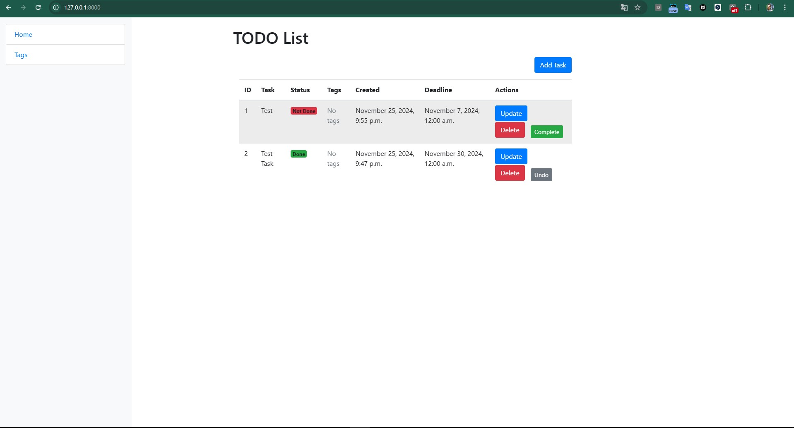

# ToDo List 

An efficient and user-friendly Django-based application for managing tasks and to-do items.

## Table of Contents

1. [About the Project](#about-the-project)
2. [Features](#features)
    - [Core Features](#core-features)
    - [User Experience](#user-experience)
    - [Technical Features](#technical-features)
    - [Advanced Features (Planned for Future Releases)](#advanced-features-planned-for-future-releases)
3. [Getting Started](#getting-started)
    - [Prerequisites](#prerequisites)
    - [Installation](#installation)
4. [Usage](#usage)
5. [Contact](#contact)

---

## About the Project

**ToDo List** is a Django web application designed to simplify task management. Whether you're organizing personal tasks or managing a small project, this tool offers an intuitive interface and essential features for productivity.

---

## Features

The ToDo List project includes various features to make managing tasks easy and organized:

### Core Features
- **Task Management**: Add, edit, delete, and manage tasks efficiently.
- **Deadlines**: Assign deadlines to tasks for better time management.
- **Task Status**: Mark tasks as "Complete" or "Incomplete."
- **Undo Functionality**: Revert task status with a single click.

### User Experience
- **Clean Interface**: Simplistic design for quick access and easy navigation.
- **Responsive Design**: Compatible with desktop and mobile devices.

### Technical Features
- **Secure Authentication**: Protect user data with Django's built-in authentication system.
- **Scalability**: Powered by Django's robust architecture to support future enhancements.

### Advanced Features (Planned for Future Releases)
- **Tag Filtering**: Categorize tasks by tags and view them easily.
- **Reminders**: Get notifications for approaching deadlines.
- **Collaborative Features**: Share tasks with others and manage as a team.

---

## Getting Started

Follow these steps to set up the project on your local machine.

### Prerequisites

- Python 3.8 or newer
- `pip` for managing Python packages
- `git` for cloning the repository

### Installation

1. Clone the repository:

    ```bash
    git clone https://github.com/your-username/todo-list.git
    ```

2. Navigate to the project directory:

    ```bash
    cd todo-list
    ```

3. Set up a virtual environment:

    ```bash
    python -m venv venv
    source venv/bin/activate  # On Windows, use "venv\Scripts\activate"
    ```

4. Install the required dependencies:

    ```bash
    pip install -r requirements.txt
    ```

5. Apply the database migrations:

    ```bash
    python manage.py migrate
    ```

6. Run the development server:

    ```bash
    python manage.py runserver
    ```

7. Open your browser and visit:

    ```
    http://127.0.0.1:8000
    ```

---

## Usage

- Create new tasks using the "Add Task" button.
- Mark tasks as complete/incomplete with a toggle option.
- Use the clean and simple interface to organize your to-do items.

---

### Web Application Interface

Below is a snapshot of the interface:




## Contact

For questions, suggestions, or collaboration opportunities, feel free to reach out:

- **Author:** [Misha](https://github.com/mgoryn)
- **Project Link:** [GitHub Repository](https://github.com/mgoryn/todo-list)

---

We hope this project helps you stay organized and productive!
